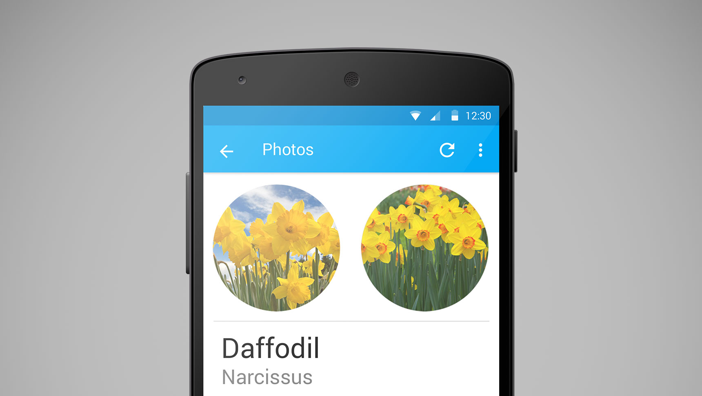

# A Flower Classification Application

A proof of concept application built with help from Andrew Zisserman and Oxford University’s Visual Geometry Group. The application allows a user to take a photo of a flower, and uses computer vision and machine learning algorithms to automatically classify the species of the flower.

The application can identify 102 common flower species with a practical accuracy of 96%.

